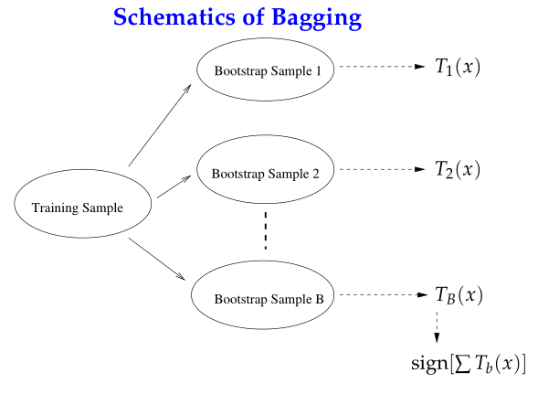
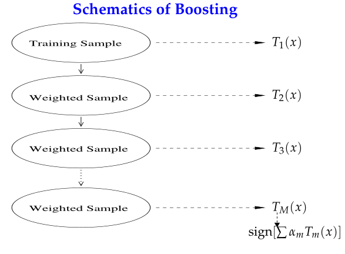
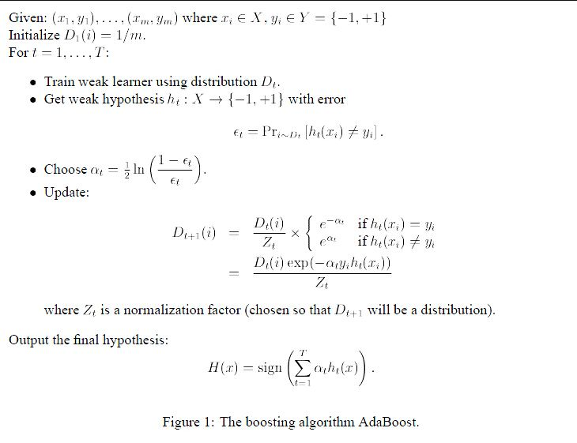

## 一、集成方法（ensemble method）
### （一）集成方法含义
> 集成方法（ensemble method）通过组合多个基分类器（base classifier）来完成学习任务，颇有点“三个臭皮匠顶个诸葛亮”的意味。
> 基分类器一般采用的是弱可学习（weakly learnable）分类器，通过集成方法，组合成一个强可学习（strongly learnable）分类器。
>* 弱可学习，是指学习的正确率仅略优于随机猜测的多项式学习算法；
>* 强可学习指正确率较高的多项式学习算法。
>* 集成学习的泛化能力一般比单一的基分类器要好，这是因为大部分基分类器都分类错误的概率远低于单一基分类器的。
### （二）集成方法分类
> 集成方法主要包括Bagging和Boosting两种方法.
> Bagging和Boosting都是将已有的分类或回归算法通过一定方式组合起来，形成一个性能更加强大的分类器，更准确的说这是一种分类算法的组装方法，即将弱分类器组装成强分类器的方法。

#### 1、Bagging

> 自举汇聚法（bootstrap aggregating），也称为bagging方法。
> Bagging对训练数据采用自举采样（boostrap sampling），即有放回地采样数据，主要思想：
>* 从原始样本集中抽取训练集。每轮从原始样本集中使用Bootstraping的方法抽取n个训练样本（在训练集中，有些样本可能被多次抽取到，而有些样本可能一次都没有被抽中）
>* 共进行k轮抽取，得到k个训练集。（k个训练集之间是相互独立的）
>* 每次使用一个训练集得到一个模型，k个训练集共得到k个模型。（注：这里并没有具体的分类算法或回归方法，可以根据具体问题采用不同的分类或回归方法，如决策树、感知器等）
>* 对分类问题：将上步得到的k个模型采用投票的方式得到分类结果；对回归问题，计算上述模型的均值作为最后的结果（所有模型的重要性相同）

#### 2、Boosting

> Boosting是一种与Bagging很类似的技术。Boosting的思路则是采用重赋权（re-weighting）法迭代地训练基分类器，主要思想：
>* 每一轮的训练数据样本赋予一个权重，并且每一轮样本的权值分布依赖上一轮的分类结果。
>* 基分类器之间采用序列式的线性加权方式进行组合。

#### 3、Bagging、Boosting二者之间的区别
（1）样本选择上：
Bagging：训练集是在原始集中有放回选取的，从原始集中选出的各轮训练集之间是独立的。
Boosting：每一轮的训练集不变，只是训练集中每个样例在分类器中的权重发生变化。而权值是根据上一轮的分类结果进行调整。
（2）样例权重：
Bagging：使用均匀取样，每个样例的权重相等。
Boosting：根据错误率不断调整样例的权值，错误率越大则权重越大。
（3）预测函数：
Bagging：所有预测函数的权重相等。
Boosting：每个弱分类器都有相应的权重，对于分类误差小的分类器会有更大的权重。
（4）并行计算：
Bagging：各个预测函数可以并行生成。
Boosting：各个预测函数只能顺序生成，因为后一个模型参数需要前一轮模型的结果。
#### 4、总结
> 这两种方法都是把若干个分类器整合为一个分类器的方法，只是整合的方式不一样，最终得到不一样的效果，将不同的分类算法套入到此类算法框架中一定程度上会提高了原单一分类器的分类效果，但是也增大了计算量。

>下面是将决策树与这些算法框架进行结合所得到的新的算法：
>* Bagging + 决策树 = 随机森林
>* AdaBoost + 决策树 = 提升树
>* Gradient Boosting + 决策树 = GBDT

## 二，AdaBoost算法
>AdaBoost算法总结

>AdaBoost算法是基于Boosting思想的机器学习算法，AdaBoost是adaptive boosting（自适应boosting）的缩写，其运行过程如下：
>* 1、计算样本权重
训练数据中的每个样本，赋予其权重，即样本权重，用向量D表示，这些权重都初始化成相等值。假设有n个样本的训练集：设定每个样本的权重都是相等的，即1/n。
>* 2、计算错误率
利用第一个弱学习算法h1对其进行学习，学习完成后进行错误率ε的统计。
>* 3、计算弱学习算法权重
弱学习算法也有一个权重，用向量α表示，利用错误率计算权重α。

## 三，Adaboost算法实现
### （一）Adaboost python自定义实现
~~~py
def adaBoostTrainDS(dataArr, classLabels, numIt = 40):
    weakClassArr = []
    m = np.shape(dataArr)[0]
    D = np.mat(np.ones((m, 1)) / m)                                            #初始化权重
    aggClassEst = np.mat(np.zeros((m,1)))
    for i in range(numIt):
        bestStump, error, classEst = buildStump(dataArr, classLabels, D)     #构建单层决策树
        print("D:",D.T)
        alpha = float(0.5 * np.log((1.0 - error) / max(error, 1e-16)))         #计算弱学习算法权重alpha,使error不等于0,因为分母不能为0
        bestStump['alpha'] = alpha                                          #存储弱学习算法权重
        weakClassArr.append(bestStump)                                      #存储单层决策树
        print("classEst: ", classEst.T)
        expon = np.multiply(-1 * alpha * np.mat(classLabels).T, classEst)     #计算e的指数项
        D = np.multiply(D, np.exp(expon))                                      
        D = D / D.sum()                                                        #根据样本权重公式，更新样本权重
        #计算AdaBoost误差，当误差为0的时候，退出循环
        aggClassEst += alpha * classEst                                 
        print("aggClassEst: ", aggClassEst.T)
        aggErrors = np.multiply(np.sign(aggClassEst) != np.mat(classLabels).T, np.ones((m,1)))     #计算误差
        errorRate = aggErrors.sum() / m
        print("total error: ", errorRate)
        if errorRate == 0.0: break                                             #误差为0，退出循环
    return weakClassArr, aggClassEst
~~~
### （二）Adaboost sklearn module实现
#### 1，sklearn.ensemble.AdaBoostClassifier()的参数
~~~py
sklearn.ensemble.AdaBoostClassifier(base_estimator=None, 
*, n_estimators=50, 
learning_rate=1.0, 
algorithm='SAMME.R', 
random_state=None)
~~~
#### 2，常用方法
|   Functions   |   Description   |
|:---------------:|:---------------:|
|decision_function(X) | Compute the decision function of X.|
|fit(X, y[, sample_weight]) |Build a boosted classifier from the training set (X, y)|
|get_params([deep]) |Get parameters for this estimator|
|predict(X)  | Predict classes for X|
|predict_log_proba(X)  |Predict class log-probabilities for X |
|predict_proba(X)   |  Predict class probabilities for X|
|score(X, y[, sample_weight])  | Return the mean accuracy on the given test data and labels|
|set_params(**params)  | Set the parameters of this estimator|
|staged_decision_function(X)  |Compute decision function of X for each boosting iteration|
|staged_predict(X)  |Return staged predictions for X|
|staged_predict_proba(X)  | Predict class probabilities for X|
|staged_score(X, y[, sample_weight]) | Return staged scores for X, y|
#### 2，实现代码
~~~py
>>> from sklearn.ensemble import AdaBoostClassifier
>>> from sklearn.datasets import make_classification
>>> X, y = make_classification(n_samples=1000, n_features=4,
...                            n_informative=2, n_redundant=0,
...                            random_state=0, shuffle=False)
>>> clf = AdaBoostClassifier(n_estimators=100, random_state=0)
>>> clf.fit(X, y)
AdaBoostClassifier(n_estimators=100, random_state=0)
>>> clf.predict([[0, 0, 0, 0]])
array([1])
>>> clf.score(X, y)
0.983...
~~~