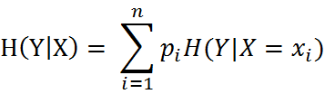
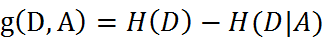

# 决策树（Decision Tree）
## 决策树定义
> 决策树(decision tree)是一种基本的分类与回归方法。

## 决策树运行流程
* 1,收集数据：可以使用任何方法。比如想构建一个相亲系统，我们可以从媒婆那里，或者通过参访相亲对象获取数据。根据他们考虑的因素和最终的选择结果，就可以得到一些供我们利用的数据了。
* 2,准备数据：收集完的数据，我们要进行整理，将这些所有收集的信息按照一定规则整理出来，并排版，方便我们进行后续处理。
* 3,分析数据：可以使用任何方法，决策树构造完成之后，我们可以检查决策树图形是否符合预期。
* 4,训练算法：这个过程也就是构造决策树，同样也可以说是决策树学习，就是构造一个决策树的数据结构。
* 5,测试算法：使用经验树计算错误率。当错误率达到了可接收范围，这个决策树就可以投放使用了。
* 6,使用算法：此步骤可以使用适用于任何监督学习算法，而使用决策树可以更好地理解数据的内在含义。

## 常用概念
* 信息增益：在划分数据集之前之后信息发生的变化为信息增益，获得信息增益最高的特征就是最好的特征选择。
* 经验熵/香农熵(empirical entropy)：熵中的概率由数据估计(特别是最大似然估计)得到时，所对应的熵称为经验熵。

* 条件熵(conditional entropy)：表示在已知随机变量X的条件下随机变量Y的不确定性，随机变量X给定的条件下随机变量Y的条件熵。

* 条件经验熵(empirical conditional entropy)：同理，当条件熵中的概率由数据估计(特别是极大似然估计)得到时，所对应的条件熵成为条件经验熵。
* 信息增益：是相对于特征而言的。特征A对训练数据集D的信息增益，定义为集合D的经验熵与特征A给定条件下D的经验条件熵之差，即：

* 熵与条件熵之差成为互信息(mutual information)。决策树学习中的信息增益等价于训练数据集中类与特征的互信息。

## 实现原理
### 计算经验熵
~~~py
def calcShannonEnt(dataSet):
    numEntires = len(dataSet)                        #返回数据集的行数
    labelCounts = {}                                #保存每个标签(Label)出现次数的字典
    for featVec in dataSet:                            #对每组特征向量进行统计
        currentLabel = featVec[-1]                    #提取标签(Label)信息
        if currentLabel not in labelCounts.keys():    #如果标签(Label)没有放入统计次数的字典,添加进去
            labelCounts[currentLabel] = 0
        labelCounts[currentLabel] += 1                #Label计数
    shannonEnt = 0.0                                #经验熵(香农熵)
    for key in labelCounts:                            #计算香农熵
        prob = float(labelCounts[key]) / numEntires    #选择该标签(Label)的概率
        shannonEnt -= prob * log(prob, 2)            #利用公式计算
    return shannonEnt                        #返回经验熵(香农熵)
~~~

### 计算信息增益
~~~py
def chooseBestFeatureToSplit(dataSet):
    numFeatures = len(dataSet[0]) - 1                    #特征数量
    baseEntropy = calcShannonEnt(dataSet)                 #计算数据集的香农熵
    bestInfoGain = 0.0                                  #信息增益
    bestFeature = -1                                    #最优特征的索引值
    for i in range(numFeatures):                         #遍历所有特征
        #获取dataSet的第i个所有特征
        featList = [example[i] for example in dataSet]
        uniqueVals = set(featList)                         #创建set集合{},元素不可重复
        newEntropy = 0.0                                  #经验条件熵
        for value in uniqueVals:                         #计算信息增益
            subDataSet = splitDataSet(dataSet, i, value)         #subDataSet划分后的子集
            prob = len(subDataSet) / float(len(dataSet))           #计算子集的概率
            newEntropy += prob * calcShannonEnt(subDataSet)     #根据公式计算经验条件熵
        infoGain = baseEntropy - newEntropy                     #信息增益
        print("第%d个特征的增益为%.3f" % (i, infoGain))            #打印每个特征的信息增益
        if (infoGain > bestInfoGain):                             #计算信息增益
            bestInfoGain = infoGain                             #更新信息增益，找到最大的信息增益
            bestFeature = i                                     #记录信息增益最大的特征的索引值
    return bestFeature                                             #返回信息增益最大的特征的索引值
~~~

## sklearn.tree实现决策树
~~~py
from sklearn import tree
#使用数据，构建决策树
clf = tree.DecisionTreeClassifier(max_depth = 4)					
clf = clf.fit(lenses_pd.values.tolist(), lenses_target)	
#对测试集进行分类
clf.predict([[1,1,1,0]])
~~~