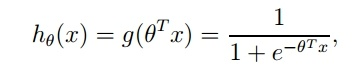
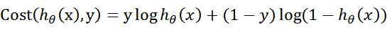
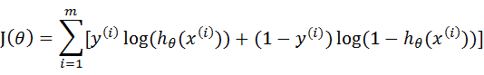
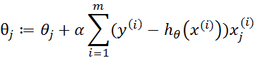

## 逻辑回归（Logistic Regression）
### 一，Logistic回归算法思想
* Logistic回归是一种二分类算法那，它利用的是Sigmoid函数阈值在[0,1]这个特性。
* Logistic回归进行分类的主要思想是：根据现有数据对分类边界线建立回归公式，以此进行分类。
* Logistic本质上是一个基于条件概率的判别模型(Discriminative Model)。

### （二）Sigmoid函数

* python实现Sigmoid函数
~~~py
def sigmoid(inX):
    return 1.0 / (1 + np.exp(-inX))
~~~

### （三）代价函数
* 代价函数，是对于一个样本而言的。给定一个样本，我们就可以通过这个代价函数求出，样本所属类别的概率，而这个概率越大越好，所以也就是求解这个代价函数的最大值。

* 满足J(θ)的最大的θ值即是我们需要求解的模型。

### （四）梯度上升算法

* python实现梯度上升算法
~~~py
def gradAscent(dataMatIn, classLabels):
    dataMatrix = np.mat(dataMatIn)         #转换成numpy的mat
    labelMat = np.mat(classLabels).transpose()   #转换成numpy的mat,并进行转置
    m, n = np.shape(dataMatrix)        #返回dataMatrix的大小。m为行数,n为列数。
    alpha = 0.001                  #移动步长,也就是学习速率,控制更新的幅度。
    maxCycles = 500                        #最大迭代次数
    weights = np.ones((n,1))
    for k in range(maxCycles):
        h = sigmoid(dataMatrix * weights)         #梯度上升矢量化公式
        error = labelMat - h
        weights = weights + alpha * dataMatrix.transpose() * error
    return weights.getA()                 #将矩阵转换为数组，返回权重数组
~~~