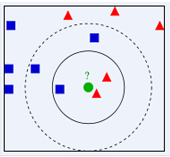

# k-NN算法（k-邻近）
> k-Nearest Neighber
## k-NN算法含义
&emsp;存在一个样本数据集合，也称作为训练样本集，并且样本集中每个数据都存在标签，即知道样本集中每一个数据与所属分类的对应关系。输入无标签的新数据后，将新的数据的每个特征与样本集中数据对应的特征进行比较，然后算法提取样本最相似数据(最近邻)的分类标签，k值一般不超过20。
> 实质：KNN是通过测量不同特征值之间的距离进行分类。

## k-NN算法步骤
* 计算已知类别数据集中的点与当前点之间的距离；
* 按照距离递增次序排序；
* 选取与当前点距离最小的k个点；
* 确定前k个点所在类别的出现频率；
* 返回前k个点所出现频率最高的类别作为当前点的预测分类

## 特征数值的归一化
&emsp;在处理这种不同取值范围的特征值时，我们通常采用的方法是将数值归一化，如将取值范围处理为０到１或者-１到１之间。
>下面的公式可以将任意取值范围的特征值转化为０到１区间内的值：
newValue = (oldValue-minValue)/(maxValue-minValue)

## k-NN算法简单实现
~~~py
    sqDiff = (inX - dataSet)**2
    sqDistance = sqDiff.sum(axis=1)
    distances = sqDistance ** 0.5
    print("distance:/n", distances)
	#返回distances中元素从小到大排序后的索引值
    sortedDistIndices = distances.argsort()
	#定一个记录类别次数的字典
    classCount = {}
    for i in range(k):
		#取出前k个元素的类别
	    voteIlabel = labels[sortedDistIndices[i]]
	    #dict.get(key,default=None),字典的get()方法,返回指定键的值,如果值不在字典中返回默认值。
		#计算类别次数
	    classCount[voteIlabel] = classCount.get(voteIlabel,0) + 1
    sortedClassCount = sorted(classCount.items(),key=operator.itemgetter(1),reverse=True)
    print("sortdClassCount:\n", sortedClassCount)
~~~
## k-NN sklearn模块实现

### 1，构建kNN分类器
~~~py
from sklearn.neighbors import KNeighborsClassifier as kNN
neigh = kNN(n_neighbors = 3, algorithm = 'auto')
~~~
#### 函数参数
 * n_neighbors为k值
 * n_neighbors: int, default=5
 * weights: {‘uniform’, ‘distance’} or callable, default=’uniform’
 * algorithm: {‘auto’, ‘ball_tree’, ‘kd_tree’, ‘brute’}, default=’auto’
 * leaf_size: int, default=30
 * p: int, default=2
 * metric: str or callable, default=’minkowski’
 * metric_params: dict, default=None 
 * n_jobs: int, default=None
### 2，拟合、训练模型, trainingMat为测试矩阵,hwLabels为对应的标签
~~~py
neigh.fit(trainingMat, hwLabels)
~~~
### 3，对测试数据集进行预测
~~~py
classifierResult = neigh.predict(vectorUnderTest)
~~~
