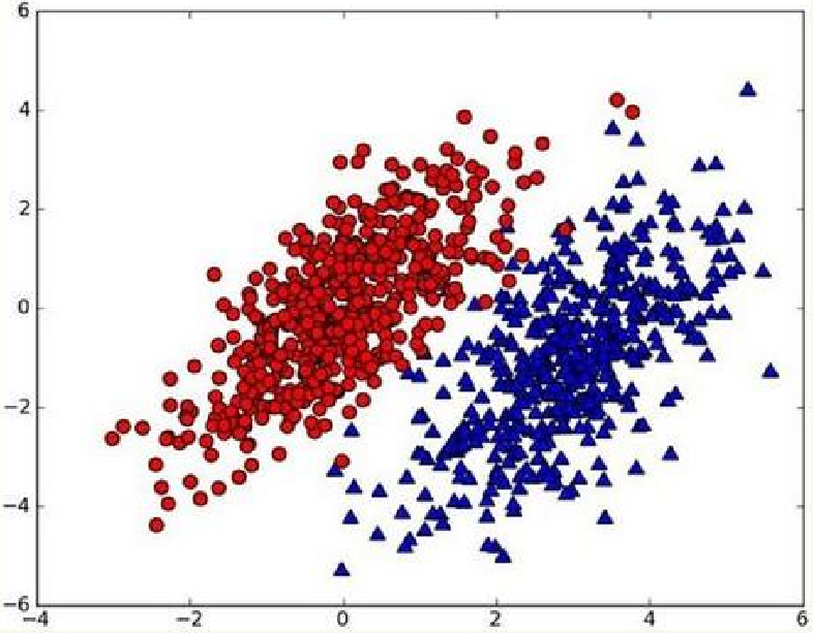
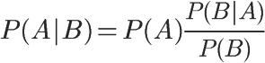
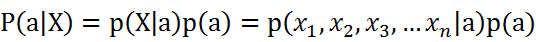
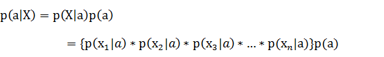

# 朴素贝叶斯（Naive Bayes）
## 一，朴素贝叶斯理论
### （一）贝叶斯理论核心思想

~~~
用p1(x,y) 表示数据点 (x,y) 属于类别1(图中红色圆点表示的类别)的概率，用 p2(x,y)表示数据点(x,y) 属于类别2(图中蓝色三角形表示的类别)的概率，那么对于一个新数据点(x,y)，可以用下面的规则来判断它的类别：
* 如果p1(x,y)>p2(x,y)，那么类别为1
* 如果p1(x,y)<p2(x,y)，那么类别为2
选择具有最高概率的决策，这就是贝叶斯决策理论的核心思想。
~~~

### （二）贝叶斯推断

~~~
1，条件概率
* P(A)称为"先验概率"（Prior probability），即在B事件发生之前，我们对A事件概率的一个判断。
* P(A|B)称为"后验概率"（Posterior probability），即在B事件发生之后，我们对A事件概率的重新评估。
* P(B|A)/P(B)称为"可能性函数"（Likelyhood），这是一个调整因子，使得预估概率更接近真实概率。

所以，条件概率可以理解成下面的式子：
后验概率　＝　先验概率 ｘ 调整因子

2，贝叶斯推断的含义
我们先预估一个"先验概率"，然后加入实验结果，看这个实验到底是增强还是削弱了"先验概率"，由此得到更接近事实的"后验概率"。
* 如果"可能性函数"P(B|A)/P(B)>1，意味着"先验概率"被增强，事件A的发生的可能性变大。
* 如果"可能性函数"=1，意味着B事件无助于判断事件A的可能性；如果"可能性函数"<1，意味着"先验概率"被削弱，事件A的可能性变小。
~~~

### （三）朴素贝叶斯推断
朴素贝叶斯对条件个概率分布做了条件独立性的假设。 比如下面的公式，假设有n个特征：

由于每个特征都是独立的，进一步拆分公式 ：

## 朴素贝叶斯编程实现
~~~py
"""
函数说明:朴素贝叶斯分类器训练函数
Parameters:
	trainMatrix - 训练文档矩阵，即setOfWords2Vec返回的returnVec构成的矩阵
	trainCategory - 训练类别标签向量，即loadDataSet返回的classVec
Returns:
	p0Vect - 非侮辱类的条件概率数组
	p1Vect - 侮辱类的条件概率数组
	pAbusive - 文档属于侮辱类的概率
"""
def trainNB0(trainMatrix,trainCategory):
    numTrainDocs = len(trainMatrix)							#计算训练的文档数目
    numWords = len(trainMatrix[0])							#计算每篇文档的词条数
    pAbusive = sum(trainCategory)/float(numTrainDocs)		#文档属于侮辱类的概率
    p0Num = np.ones(numWords); p1Num = np.ones(numWords)	#创建numpy.ones数组,词条出现数初始化为1，拉普拉斯平滑
    p0Denom = 2.0; p1Denom = 2.0                        	#分母初始化为2,拉普拉斯平滑
    for i in range(numTrainDocs):
        if trainCategory[i] == 1:							#统计属于侮辱类的条件概率所需的数据，即P(w0|1),P(w1|1),P(w2|1)···
            p1Num += trainMatrix[i]
            p1Denom += sum(trainMatrix[i])
        else:												#统计属于非侮辱类的条件概率所需的数据，即P(w0|0),P(w1|0),P(w2|0)···
            p0Num += trainMatrix[i]
            p0Denom += sum(trainMatrix[i])
    p1Vect = np.log(p1Num/p1Denom)							#取对数，防止下溢出          
    p0Vect = np.log(p0Num/p0Denom)          
    return p0Vect,p1Vect,pAbusive							#返回属于侮辱类的条件概率数组，属于非侮辱类的条件概率数组，文档属于侮辱类的概率

"""
函数说明:朴素贝叶斯分类器分类函数
Parameters:
	vec2Classify - 待分类的词条数组
	p0Vec - 非侮辱类的条件概率数组
	p1Vec -侮辱类的条件概率数组
	pClass1 - 文档属于侮辱类的概率
Returns:
	0 - 属于非侮辱类
	1 - 属于侮辱类
"""
def classifyNB(vec2Classify, p0Vec, p1Vec, pClass1):
    p1 = sum(vec2Classify * p1Vec) + np.log(pClass1)    	#对应元素相乘。logA * B = logA + logB，所以这里加上log(pClass1)
    p0 = sum(vec2Classify * p0Vec) + np.log(1.0 - pClass1)
    if p1 > p0:
        return 1
    else: 
        return 0
~~~
