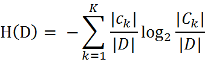
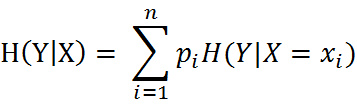
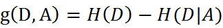

# 决策树（Decision Tree）
## 一，决策树定义
> 决策树(decision tree)是一种基本的分类与回归方法。

## 二，决策树运行流程
* 1,收集数据：可以使用任何方法。比如想构建一个相亲系统，我们可以从媒婆那里，或者通过参访相亲对象获取数据。根据他们考虑的因素和最终的选择结果，就可以得到一些供我们利用的数据了。
* 2,准备数据：收集完的数据，我们要进行整理，将这些所有收集的信息按照一定规则整理出来，并排版，方便我们进行后续处理。
* 3,分析数据：可以使用任何方法，决策树构造完成之后，我们可以检查决策树图形是否符合预期。
* 4,训练算法：这个过程也就是构造决策树，同样也可以说是决策树学习，就是构造一个决策树的数据结构。
* 5,测试算法：使用经验树计算错误率。当错误率达到了可接收范围，这个决策树就可以投放使用了。
* 6,使用算法：此步骤可以使用适用于任何监督学习算法，而使用决策树可以更好地理解数据的内在含义。

## 三，决策树常用概念
* 信息增益：在划分数据集之前之后信息发生的变化为信息增益，获得信息增益最高的特征就是最好的特征选择。
* 经验熵/香农熵(empirical entropy)：熵中的概率由数据估计(特别是最大似然估计)得到时，所对应的熵称为经验熵。

* 条件熵(conditional entropy)：表示在已知随机变量X的条件下随机变量Y的不确定性，随机变量X给定的条件下随机变量Y的条件熵。

* 条件经验熵(empirical conditional entropy)：同理，当条件熵中的概率由数据估计(特别是极大似然估计)得到时，所对应的条件熵成为条件经验熵。
* 信息增益：是相对于特征而言的。特征A对训练数据集D的信息增益，定义为集合D的经验熵与特征A给定条件下D的经验条件熵之差，即：

* 熵与条件熵之差成为互信息(mutual information)。决策树学习中的信息增益等价于训练数据集中类与特征的互信息。

## 四，决策树实现原理
### （一）计算经验熵
~~~py
def calcShannonEnt(dataSet):
    numEntires = len(dataSet)                        #返回数据集的行数
    labelCounts = {}                                #保存每个标签(Label)出现次数的字典
    for featVec in dataSet:                            #对每组特征向量进行统计
        currentLabel = featVec[-1]                    #提取标签(Label)信息
        if currentLabel not in labelCounts.keys():    #如果标签(Label)没有放入统计次数的字典,添加进去
            labelCounts[currentLabel] = 0
        labelCounts[currentLabel] += 1                #Label计数
    shannonEnt = 0.0                                #经验熵(香农熵)
    for key in labelCounts:                            #计算香农熵
        prob = float(labelCounts[key]) / numEntires    #选择该标签(Label)的概率
        shannonEnt -= prob * log(prob, 2)            #利用公式计算
    return shannonEnt                        #返回经验熵(香农熵)
~~~

### （二）计算信息增益
~~~py
def chooseBestFeatureToSplit(dataSet):
    numFeatures = len(dataSet[0]) - 1                    #特征数量
    baseEntropy = calcShannonEnt(dataSet)                 #计算数据集的香农熵
    bestInfoGain = 0.0                                  #信息增益
    bestFeature = -1                                    #最优特征的索引值
    for i in range(numFeatures):                         #遍历所有特征
        #获取dataSet的第i个所有特征
        featList = [example[i] for example in dataSet]
        uniqueVals = set(featList)                         #创建set集合{},元素不可重复
        newEntropy = 0.0                                  #经验条件熵
        for value in uniqueVals:                         #计算信息增益
            subDataSet = splitDataSet(dataSet, i, value)         #subDataSet划分后的子集
            prob = len(subDataSet) / float(len(dataSet))           #计算子集的概率
            newEntropy += prob * calcShannonEnt(subDataSet)     #根据公式计算经验条件熵
        infoGain = baseEntropy - newEntropy                     #信息增益
        print("第%d个特征的增益为%.3f" % (i, infoGain))            #打印每个特征的信息增益
        if (infoGain > bestInfoGain):                             #计算信息增益
            bestInfoGain = infoGain                             #更新信息增益，找到最大的信息增益
            bestFeature = i                                     #记录信息增益最大的特征的索引值
    return bestFeature                                             #返回信息增益最大的特征的索引值
~~~

## 五，sklearn.tree实现决策树分类器（Decision Classifier）
### （一）导入tree模块
~~~py
from sklearn import tree
~~~

### （二）构建决策树
~~~py
sklearn.tree.DecisionTreeClassifier(*, 
criterion='gini', 
splitter='best', 
max_depth=None, 
min_samples_split=2, 
min_samples_leaf=1, 
min_weight_fraction_leaf=0.0, max_features=None, 
random_state=None, 
max_leaf_nodes=None, 
min_impurity_decrease=0.0, min_impurity_split=None, 
class_weight=None, 
ccp_alpha=0.0)
~~~

#### 参数详解：
~~~
* criterion{“gini”, “entropy”}, default=”gini”
The function to measure the quality of a split. Supported criteria are “gini” for the Gini impurity and “entropy” for the information gain.
衡量分割质量的功能。支持的标准是对基尼杂质的“基尼”和对信息增益的“熵”。

* splitter{“best”, “random”}, default=”best”
The strategy used to choose the split at each node. Supported strategies are “best” to choose the best split and “random” to choose the best random split.
用于在每个节点上选择拆分的策略。支持的策略是“最佳”选择最佳拆分，“随机”选择最佳随机拆分。

* max_depthint, default=None
The maximum depth of the tree. If None, then nodes are expanded until all leaves are pure or until all leaves contain less than min_samples_split samples.
树的最大深度。如果为None，则将节点展开，直到所有叶子都是纯净的，或者直到所有叶子都包含少于min_samples_split个样本。

* min_samples_splitint or float, default=2
The minimum number of samples required to split an internal node:
** If int, then consider min_samples_split as the minimum number.
** If float, then min_samples_split is a fraction and ceil(min_samples_split * n_samples) are the minimum number of samples for each split.
在叶节点处需要的最小样本数。仅在任何深度的分裂点在min_samples_leaf左分支和右分支中的每个分支上至少留下训练样本时，才考虑。这可能具有平滑模型的效果，尤其是在回归中。
如果为int，则认为min_samples_leaf是最小值。
如果为float，min_samples_leaf则为分数， 是每个节点的最小样本数。ceil(min_samples_leaf * n_samples)
~~~
~~~py
clf = clf.fit(trainSet, labels)
~~~
### （三）对测试集进行分类
~~~py
clf.predict(testSet)
~~~

### （四）sklearn决策树使用示例
~~~py
from sklearn import tree
X = [[0, 0], [1, 1]]
Y = [0, 1]
clf = tree.DecisionTreeClassifier()
clf = clf.fit(X, Y)
#预测样本类别
clf.predict([[2., 2.]])  #array([1])
#预测每个类的概率(这个概率是叶中相同类的训练样本的分数)
clf.predict_proba([[2., 2.]])  #array([[ 0.,  1.]])
~~~

### （五）sklearn决策树方法
| 方法   |    描述   |
|:-----:|:---------:|
|apply（X [，check_input]）| 返回每个样本被预测为的叶子的索引。|
|cost_complexity_pruning_path（X，y [，…]）| 在最小成本复杂性修剪期间计算修剪路径。|
|decision_path（X [，check_input]）| 返回树中的决策路径。|
|fit（X，y [，sample_weight，check_input，…]）| 从训练集（X，y）构建决策树分类器。|
|get_depth（）|返回决策树的深度。|
|get_n_leaves（）|返回决策树的叶子数。|
|get_params（[深的]）|获取此估计量的参数。|
|predict（X [，check_input]）|预测X的类或回归值。|
|predict_log_proba（X）|预测输入样本X的类对数概率。|
|predict_proba（X [，check_input]）|预测输入样本X的类别概率。|
|score（X，y [，sample_weight]）|返回给定测试数据和标签上的平均准确度。|
|set_params（**参数）| 设置此估算器的参数。|

## 六，sklearn.tree实现决策树回归（Decision Regressionor）
> 决策树通过使用 DecisionTreeRegressor 类也可以用来解决回归问题。如在分类设置中，拟合方法将数组X和数组y作为参数，只有在这种情况下，y数组预期才是浮点值:
~~~py
>>> from sklearn import tree
>>> X = [[0, 0], [2, 2]]
>>> y = [0.5, 2.5]
>>> clf = tree.DecisionTreeRegressor()
>>> clf = clf.fit(X, y)
>>> clf.predict([[1, 1]])
array([ 0.5])
~~~